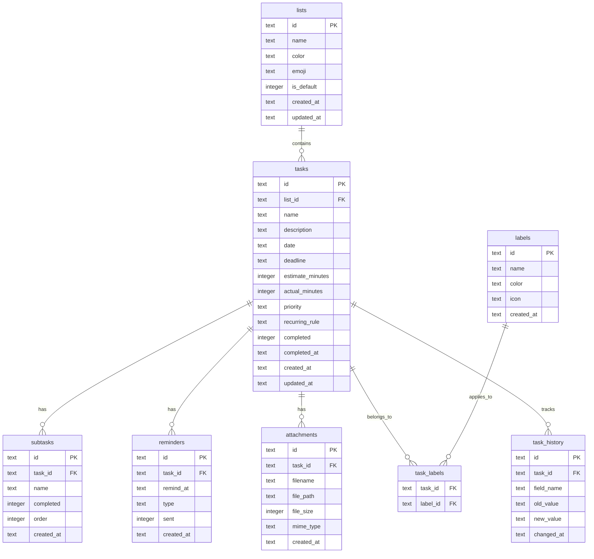

# Database Schema Design - Daily Task Planner

## Overview

This document defines the SQLite database schema for a daily task planner application. The schema supports task management with lists, labels, subtasks, reminders, attachments, and change history tracking.

## Entity-Relationship Diagram



## Table Definitions

### 1. Lists

Stores user-defined lists for organizing tasks. Each user has a default Inbox list.

| Column | Type | Constraints | Description |
|--------|------|-------------|-------------|
| id | TEXT | PRIMARY KEY, NOT NULL | UUID v4 identifier |
| name | TEXT | NOT NULL | Display name of the list |
| color | TEXT | NOT NULL, DEFAULT #6366f1 | Hex color code for UI display |
| emoji | TEXT | NULL | Optional emoji icon |
| is_default | INTEGER | NOT NULL, DEFAULT 0 | Boolean flag for Inbox list |
| created_at | TEXT | NOT NULL | ISO 8601 datetime string |
| updated_at | TEXT | NOT NULL | ISO 8601 datetime string |

**SQLite CREATE statement:**
```sql
CREATE TABLE lists (
    id TEXT PRIMARY KEY NOT NULL,
    name TEXT NOT NULL,
    color TEXT NOT NULL DEFAULT '#6366f1',
    emoji TEXT,
    is_default INTEGER NOT NULL DEFAULT 0,
    created_at TEXT NOT NULL,
    updated_at TEXT NOT NULL
);
```

### 2. Tasks

The core entity storing all task information.

| Column | Type | Constraints | Description |
|--------|------|-------------|-------------|
| id | TEXT | PRIMARY KEY, NOT NULL | UUID v4 identifier |
| list_id | TEXT | FOREIGN KEY, NOT NULL | Reference to parent list |
| name | TEXT | NOT NULL | Task title |
| description | TEXT | NULL | Detailed task description |
| date | TEXT | NULL | ISO 8601 datetime for scheduled date |
| deadline | TEXT | NULL | ISO 8601 datetime for due date |
| estimate_minutes | INTEGER | NULL | Estimated time to complete |
| actual_minutes | INTEGER | NULL | Actual time spent |
| priority | TEXT | NOT NULL, DEFAULT none | Enum: high, medium, low, none |
| recurring_rule | TEXT | NULL | RRULE format string or JSON |
| completed | INTEGER | NOT NULL, DEFAULT 0 | Boolean completion flag |
| completed_at | TEXT | NULL | ISO 8601 datetime when completed |
| created_at | TEXT | NOT NULL | ISO 8601 datetime string |
| updated_at | TEXT | NOT NULL | ISO 8601 datetime string |

**SQLite CREATE statement:**
```sql
CREATE TABLE tasks (
    id TEXT PRIMARY KEY NOT NULL,
    list_id TEXT NOT NULL,
    name TEXT NOT NULL,
    description TEXT,
    date TEXT,
    deadline TEXT,
    estimate_minutes INTEGER,
    actual_minutes INTEGER,
    priority TEXT NOT NULL DEFAULT 'none',
    recurring_rule TEXT,
    completed INTEGER NOT NULL DEFAULT 0,
    completed_at TEXT,
    created_at TEXT NOT NULL,
    updated_at TEXT NOT NULL,
    FOREIGN KEY (list_id) REFERENCES lists(id) ON DELETE CASCADE
);
```

### 3. Labels

User-defined labels for categorizing tasks across lists.

| Column | Type | Constraints | Description |
|--------|------|-------------|-------------|
| id | TEXT | PRIMARY KEY, NOT NULL | UUID v4 identifier |
| name | TEXT | NOT NULL, UNIQUE | Label name |
| color | TEXT | NOT NULL, DEFAULT #8b5cf6 | Hex color code |
| icon | TEXT | NULL | Emoji or icon identifier |
| created_at | TEXT | NOT NULL | ISO 8601 datetime string |

**SQLite CREATE statement:**
```sql
CREATE TABLE labels (
    id TEXT PRIMARY KEY NOT NULL,
    name TEXT NOT NULL UNIQUE,
    color TEXT NOT NULL DEFAULT '#8b5cf6',
    icon TEXT,
    created_at TEXT NOT NULL
);
```

### 4. Task_Labels

Junction table for many-to-many relationship between tasks and labels.

| Column | Type | Constraints | Description |
|--------|------|-------------|-------------|
| task_id | TEXT | FOREIGN KEY, NOT NULL | Reference to task |
| label_id | TEXT | FOREIGN KEY, NOT NULL | Reference to label |

**SQLite CREATE statement:**
```sql
CREATE TABLE task_labels (
    task_id TEXT NOT NULL,
    label_id TEXT NOT NULL,
    PRIMARY KEY (task_id, label_id),
    FOREIGN KEY (task_id) REFERENCES tasks(id) ON DELETE CASCADE,
    FOREIGN KEY (label_id) REFERENCES labels(id) ON DELETE CASCADE
);
```

### 5. Subtasks

Checklist items within a task.

| Column | Type | Constraints | Description |
|--------|------|-------------|-------------|
| id | TEXT | PRIMARY KEY, NOT NULL | UUID v4 identifier |
| task_id | TEXT | FOREIGN KEY, NOT NULL | Reference to parent task |
| name | TEXT | NOT NULL | Subtask title |
| completed | INTEGER | NOT NULL, DEFAULT 0 | Boolean completion flag |
| order | INTEGER | NOT NULL, DEFAULT 0 | Sort order within task |
| created_at | TEXT | NOT NULL | ISO 8601 datetime string |

**SQLite CREATE statement:**
```sql
CREATE TABLE subtasks (
    id TEXT PRIMARY KEY NOT NULL,
    task_id TEXT NOT NULL,
    name TEXT NOT NULL,
    completed INTEGER NOT NULL DEFAULT 0,
    order INTEGER NOT NULL DEFAULT 0,
    created_at TEXT NOT NULL,
    FOREIGN KEY (task_id) REFERENCES tasks(id) ON DELETE CASCADE
);
```

### 6. Reminders

Scheduled reminders for tasks.

| Column | Type | Constraints | Description |
|--------|------|-------------|-------------|
| id | TEXT | PRIMARY KEY, NOT NULL | UUID v4 identifier |
| task_id | TEXT | FOREIGN KEY, NOT NULL | Reference to task |
| remind_at | TEXT | NOT NULL | ISO 8601 datetime to trigger |
| type | TEXT | NOT NULL, DEFAULT notification | Enum: notification, email |
| sent | INTEGER | NOT NULL, DEFAULT 0 | Boolean sent status |
| created_at | TEXT | NOT NULL | ISO 8601 datetime string |

**SQLite CREATE statement:**
```sql
CREATE TABLE reminders (
    id TEXT PRIMARY KEY NOT NULL,
    task_id TEXT NOT NULL,
    remind_at TEXT NOT NULL,
    type TEXT NOT NULL DEFAULT 'notification',
    sent INTEGER NOT NULL DEFAULT 0,
    created_at TEXT NOT NULL,
    FOREIGN KEY (task_id) REFERENCES tasks(id) ON DELETE CASCADE
);
```

### 7. Attachments

File attachments linked to tasks.

| Column | Type | Constraints | Description |
|--------|------|-------------|-------------|
| id | TEXT | PRIMARY KEY, NOT NULL | UUID v4 identifier |
| task_id | TEXT | FOREIGN KEY, NOT NULL | Reference to task |
| filename | TEXT | NOT NULL | Original filename |
| file_path | TEXT | NOT NULL | Storage path on disk |
| file_size | INTEGER | NOT NULL | Size in bytes |
| mime_type | TEXT | NOT NULL | MIME type identifier |
| created_at | TEXT | NOT NULL | ISO 8601 datetime string |

**SQLite CREATE statement:**
```sql
CREATE TABLE attachments (
    id TEXT PRIMARY KEY NOT NULL,
    task_id TEXT NOT NULL,
    filename TEXT NOT NULL,
    file_path TEXT NOT NULL,
    file_size INTEGER NOT NULL,
    mime_type TEXT NOT NULL,
    created_at TEXT NOT NULL,
    FOREIGN KEY (task_id) REFERENCES tasks(id) ON DELETE CASCADE
);
```

### 8. Task_History

Audit log for tracking changes to tasks.

| Column | Type | Constraints | Description |
|--------|------|-------------|-------------|
| id | TEXT | PRIMARY KEY, NOT NULL | UUID v4 identifier |
| task_id | TEXT | FOREIGN KEY, NOT NULL | Reference to task |
| field_name | TEXT | NOT NULL | Name of changed field |
| old_value | TEXT | NULL | JSON-serialized previous value |
| new_value | TEXT | NULL | JSON-serialized new value |
| changed_at | TEXT | NOT NULL | ISO 8601 datetime string |

**SQLite CREATE statement:**
```sql
CREATE TABLE task_history (
    id TEXT PRIMARY KEY NOT NULL,
    task_id TEXT NOT NULL,
    field_name TEXT NOT NULL,
    old_value TEXT,
    new_value TEXT,
    changed_at TEXT NOT NULL,
    FOREIGN KEY (task_id) REFERENCES tasks(id) ON DELETE CASCADE
);
```

## Indexes

Strategic indexes for optimizing common query patterns:

### Tasks Table Indexes

```sql
-- Fast lookup of tasks by list
CREATE INDEX idx_tasks_list_id ON tasks(list_id);

-- Filter tasks by scheduled date - common for daily views
CREATE INDEX idx_tasks_date ON tasks(date);

-- Filter tasks by completion status
CREATE INDEX idx_tasks_completed ON tasks(completed);

-- Filter tasks by deadline for overdue queries
CREATE INDEX idx_tasks_deadline ON tasks(deadline);

-- Composite index for common dashboard query: incomplete tasks by date
CREATE INDEX idx_tasks_date_completed ON tasks(date, completed);

-- Composite index for list view with completion filter
CREATE INDEX idx_tasks_list_completed ON tasks(list_id, completed);
```

### Subtasks Table Indexes

```sql
-- Get all subtasks for a task in order
CREATE INDEX idx_subtasks_task_id ON subtasks(task_id);
```

### Reminders Table Indexes

```sql
-- Find pending reminders to send
CREATE INDEX idx_reminders_pending ON reminders(remind_at, sent);

-- Get all reminders for a task
CREATE INDEX idx_reminders_task_id ON reminders(task_id);
```

### Attachments Table Indexes

```sql
-- Get all attachments for a task
CREATE INDEX idx_attachments_task_id ON attachments(task_id);
```

### Task_History Table Indexes

```sql
-- Get change history for a task
CREATE INDEX idx_task_history_task_id ON task_history(task_id);

-- Get recent changes across all tasks
CREATE INDEX idx_task_history_changed_at ON task_history(changed_at);
```

### Task_Labels Table Indexes

```sql
-- Find all tasks with a specific label
CREATE INDEX idx_task_labels_label_id ON task_labels(label_id);
```

## Relationships

### One-to-Many Relationships

| Parent | Child | Foreign Key | Delete Rule |
|--------|-------|-------------|-------------|
| lists | tasks | list_id | CASCADE |
| tasks | subtasks | task_id | CASCADE |
| tasks | reminders | task_id | CASCADE |
| tasks | attachments | task_id | CASCADE |
| tasks | task_history | task_id | CASCADE |

### Many-to-Many Relationships

| Entity A | Entity B | Junction Table |
|----------|----------|----------------|
| tasks | labels | task_labels |

## Design Decisions

### UUID Primary Keys

All primary keys use UUID v4 stored as TEXT. This provides:
- Globally unique identifiers
- No collision risk when merging data
- Client-side generation capability
- No auto-increment coupling

### SQLite Boolean Handling

SQLite does not have a native boolean type. All boolean fields use INTEGER:
- 0 = false
- 1 = true

### DateTime Storage

All datetime values are stored as TEXT in ISO 8601 format:
- Format: `YYYY-MM-DDTHH:MM:SS.sssZ`
- Example: `2024-01-15T09:30:00.000Z`
- Enables proper sorting and date functions

### Cascade Deletes

All foreign key relationships use `ON DELETE CASCADE` to maintain referential integrity:
- Deleting a list removes all its tasks
- Deleting a task removes all subtasks, reminders, attachments, and history
- Deleting a label removes the association from task_labels

### Soft Deletes Consideration

This schema uses hard deletes with cascade. If soft deletes are needed in the future, add:
- `deleted_at TEXT` column to relevant tables
- Filter queries with `WHERE deleted_at IS NULL`

### Recurring Tasks

The `recurring_rule` field supports:
- RRULE format (RFC 5545) for complex recurrence patterns
- JSON format for simpler custom patterns

Example RRULE: `FREQ=DAILY;INTERVAL=1;COUNT=10`
Example JSON: `{"frequency": "weekly", "days": ["mon", "wed", "fri"]}`

### Priority System

Priority is stored as TEXT enum with values:
- `high` - Urgent tasks
- `medium` - Important but not urgent
- `low` - Nice to have
- `none` - Default, no priority set

## Full Schema SQL

```sql
-- Enable foreign key support
PRAGMA foreign_keys = ON;

-- Lists table
CREATE TABLE lists (
    id TEXT PRIMARY KEY NOT NULL,
    name TEXT NOT NULL,
    color TEXT NOT NULL DEFAULT '#6366f1',
    emoji TEXT,
    is_default INTEGER NOT NULL DEFAULT 0,
    created_at TEXT NOT NULL,
    updated_at TEXT NOT NULL
);

-- Tasks table
CREATE TABLE tasks (
    id TEXT PRIMARY KEY NOT NULL,
    list_id TEXT NOT NULL,
    name TEXT NOT NULL,
    description TEXT,
    date TEXT,
    deadline TEXT,
    estimate_minutes INTEGER,
    actual_minutes INTEGER,
    priority TEXT NOT NULL DEFAULT 'none',
    recurring_rule TEXT,
    completed INTEGER NOT NULL DEFAULT 0,
    completed_at TEXT,
    created_at TEXT NOT NULL,
    updated_at TEXT NOT NULL,
    FOREIGN KEY (list_id) REFERENCES lists(id) ON DELETE CASCADE
);

-- Labels table
CREATE TABLE labels (
    id TEXT PRIMARY KEY NOT NULL,
    name TEXT NOT NULL UNIQUE,
    color TEXT NOT NULL DEFAULT '#8b5cf6',
    icon TEXT,
    created_at TEXT NOT NULL
);

-- Task_Labels junction table
CREATE TABLE task_labels (
    task_id TEXT NOT NULL,
    label_id TEXT NOT NULL,
    PRIMARY KEY (task_id, label_id),
    FOREIGN KEY (task_id) REFERENCES tasks(id) ON DELETE CASCADE,
    FOREIGN KEY (label_id) REFERENCES labels(id) ON DELETE CASCADE
);

-- Subtasks table
CREATE TABLE subtasks (
    id TEXT PRIMARY KEY NOT NULL,
    task_id TEXT NOT NULL,
    name TEXT NOT NULL,
    completed INTEGER NOT NULL DEFAULT 0,
    order INTEGER NOT NULL DEFAULT 0,
    created_at TEXT NOT NULL,
    FOREIGN KEY (task_id) REFERENCES tasks(id) ON DELETE CASCADE
);

-- Reminders table
CREATE TABLE reminders (
    id TEXT PRIMARY KEY NOT NULL,
    task_id TEXT NOT NULL,
    remind_at TEXT NOT NULL,
    type TEXT NOT NULL DEFAULT 'notification',
    sent INTEGER NOT NULL DEFAULT 0,
    created_at TEXT NOT NULL,
    FOREIGN KEY (task_id) REFERENCES tasks(id) ON DELETE CASCADE
);

-- Attachments table
CREATE TABLE attachments (
    id TEXT PRIMARY KEY NOT NULL,
    task_id TEXT NOT NULL,
    filename TEXT NOT NULL,
    file_path TEXT NOT NULL,
    file_size INTEGER NOT NULL,
    mime_type TEXT NOT NULL,
    created_at TEXT NOT NULL,
    FOREIGN KEY (task_id) REFERENCES tasks(id) ON DELETE CASCADE
);

-- Task_History table
CREATE TABLE task_history (
    id TEXT PRIMARY KEY NOT NULL,
    task_id TEXT NOT NULL,
    field_name TEXT NOT NULL,
    old_value TEXT,
    new_value TEXT,
    changed_at TEXT NOT NULL,
    FOREIGN KEY (task_id) REFERENCES tasks(id) ON DELETE CASCADE
);

-- Indexes
CREATE INDEX idx_tasks_list_id ON tasks(list_id);
CREATE INDEX idx_tasks_date ON tasks(date);
CREATE INDEX idx_tasks_completed ON tasks(completed);
CREATE INDEX idx_tasks_deadline ON tasks(deadline);
CREATE INDEX idx_tasks_date_completed ON tasks(date, completed);
CREATE INDEX idx_tasks_list_completed ON tasks(list_id, completed);
CREATE INDEX idx_subtasks_task_id ON subtasks(task_id);
CREATE INDEX idx_reminders_pending ON reminders(remind_at, sent);
CREATE INDEX idx_reminders_task_id ON reminders(task_id);
CREATE INDEX idx_attachments_task_id ON attachments(task_id);
CREATE INDEX idx_task_history_task_id ON task_history(task_id);
CREATE INDEX idx_task_history_changed_at ON task_history(changed_at);
CREATE INDEX idx_task_labels_label_id ON task_labels(label_id);
```

## TypeScript Type Mapping

| SQLite Type | TypeScript Type | Description |
|-------------|-----------------|-------------|
| TEXT (UUID) | string | UUID v4 format |
| TEXT (datetime) | string | ISO 8601 format |
| TEXT (enum) | string | Union type |
| TEXT (general) | string | General text |
| INTEGER (boolean) | boolean | 0/1 mapped to false/true |
| INTEGER | number | Integer values |
| TEXT (JSON) | T | Generic JSON-serializable |
